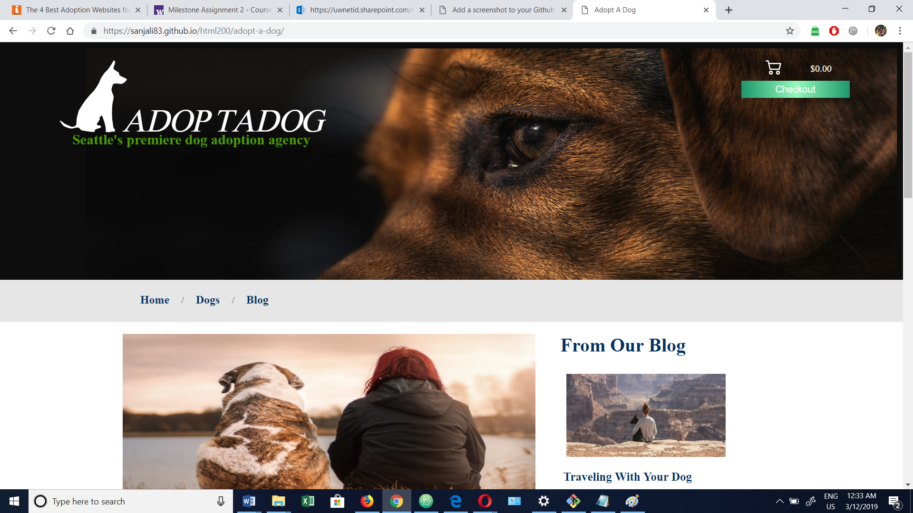
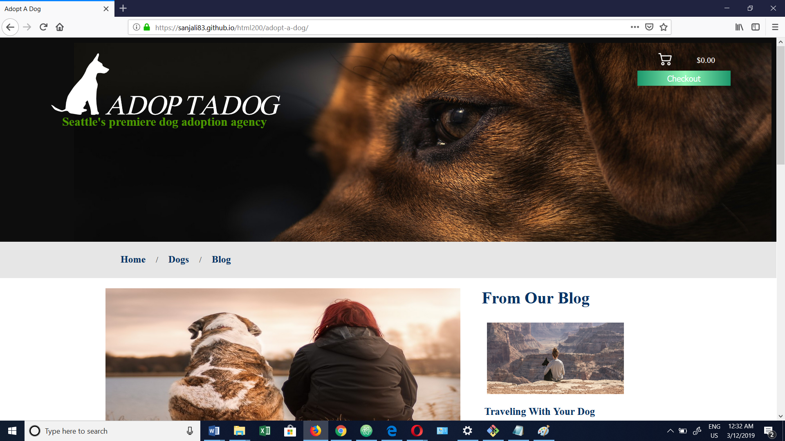
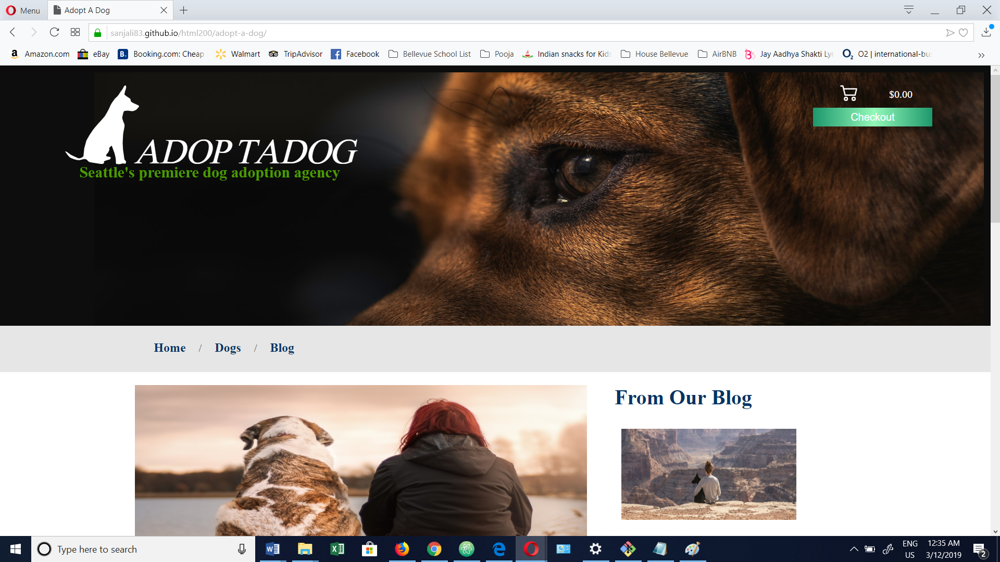
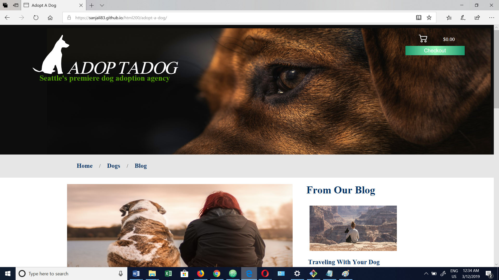
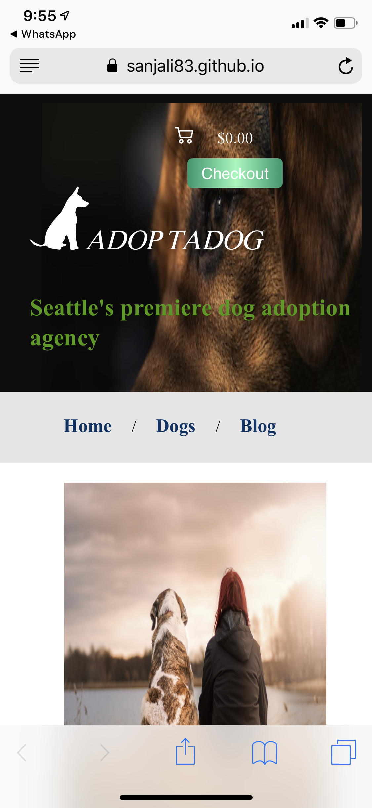
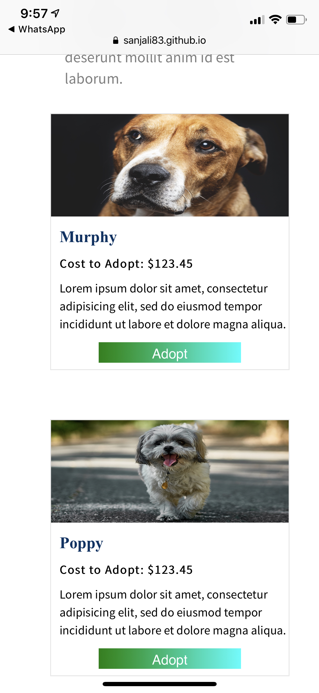
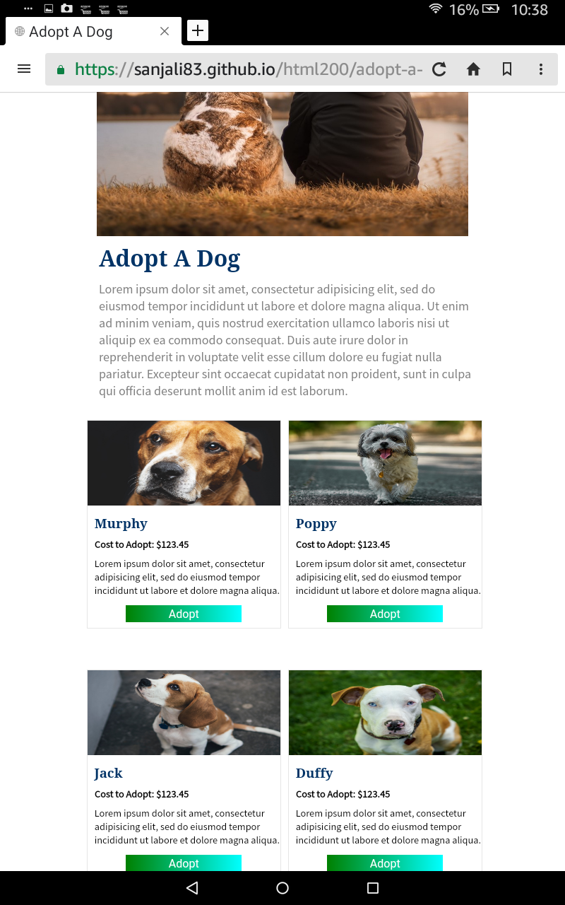
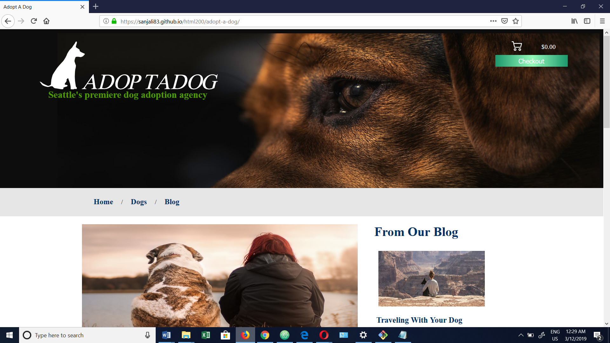
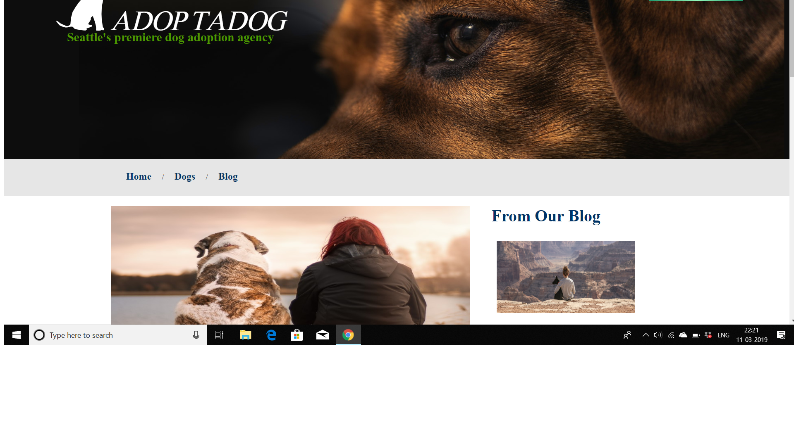

AdoptADog

-----A Non-Profit Pet Adoption Website

-----Made By  Anjali Shah

-----Last Updated: March 2019
--------------------------------------------------------------------------------------------------------------------------------
Project Description
  This Web-Page helps it user to Adopt a Dog Online. The Web-page content text, images, links , buttons and form.  

Language Information
  Web-Site is built with:
	•HTML
	•CSS 
	•Javascript
Persona 
     1.	John Smith
      •	John Smith is in his 30s.
      •	He leaves in Seattle
      •	He works as Operation Manager at Insurance Company. 
      •	He’s not married, has no kids.
      • John’s works full time and earns 5 figure income that allows him to fulfill his passion.
      • He loves to go on hiking and trails. He minimum walks 5 miles a day.
      • He wants to adopt a dog, with whom he can do all these activities.
      • Due to his busy schedule, he is planning to search his dog online.
      Internet Access:
        - He is technical person and has access to high speed internet.
        - He has high end Laptop and latest Android Phone.
      Typical Internet Activity:
        - Check Mails.
        - Check for Outdoor activities and Events.
        - Active on Social Media.

    2. Mia Jones
      • Mia Smith is 36 years old, married women.
      • She lives with her husband and a daughter in Redmond.
      • Mia is a Home Baker and her husband is Management Consultant. He has to travels a lot.
      • Mia’s daughter has Down Syndrome. So, She want to adopt friendly dog as a companion for her daughter.
      • Internet Usage:
          - Mia access to computer is very low.
	  - She mostly watches baking videos or Educational Video on Youtube.
	  - She has medium speed internet at home.
      • Mia uses reading glasses. She hates sites with small print, as she finds it difficult to read.
      • Mia prefer to take web printouts instead of reading online.

Web-Site Features
	• A unique, descriptive title is given to individual pages.
	• Links are provided on every-page for easy navigation.
	• Textual alternatives accompany images in order to make the content and purpose of images accessible to visually disable individual.
	• Interactive elements of the form are given tab order.
	• Website is design responsive for better user experience. As website scales and responds to the change in screen size, the user won’t have problems accessing menus, links, button or form filling.
	• The website looks professional on all platforms. The use of responsive image help improve webpage loading speed.

Code Snippet
   1. HTML code for Responsive Image
            
   2. CSS Code for Navigation Bar
             .nav-bar {
                       padding: 0.5rem;
                       width: 40%;
                       height: 3.5rem;
                       display: flex;
                       flex-direction: row;
                       justify-content: start;
                       list-style-type: none;
                     }
  3. Java  Script  Function
	     function checkoutCalculation(price) {
  		let temp = sessionStorage.getItem("cartAmount");
		sessionStorage.setItem("cartAmount", (Number(temp) + Number(price)));
                document.getElementById('cartAmount').innerHTML = '$' + sessionStorage.getItem("cartAmount");
                             alert ('Your Total Adoption Cost is : $' + sessionStorage.getItem("cartAmount") + '. Checkout to complete the Adoption process.');
              }

Browser Testing

	1. Chrome Browser
	
		

	2. FireFox Browser

		

	3. Opera Browser

		

	4. Edge Browser

		

Screen Testing

	1. iPhone - X (Screen Size : 5.8 Inch)

		

		

	2. Fire Hd Tablet (Screen Size : 10 Inch)

		

		

	3. Dell Laptop (Screen Size : 15.6 Inch)

		

		

	4. Dell Screen (Screen Size : 27 Inch)

		

		